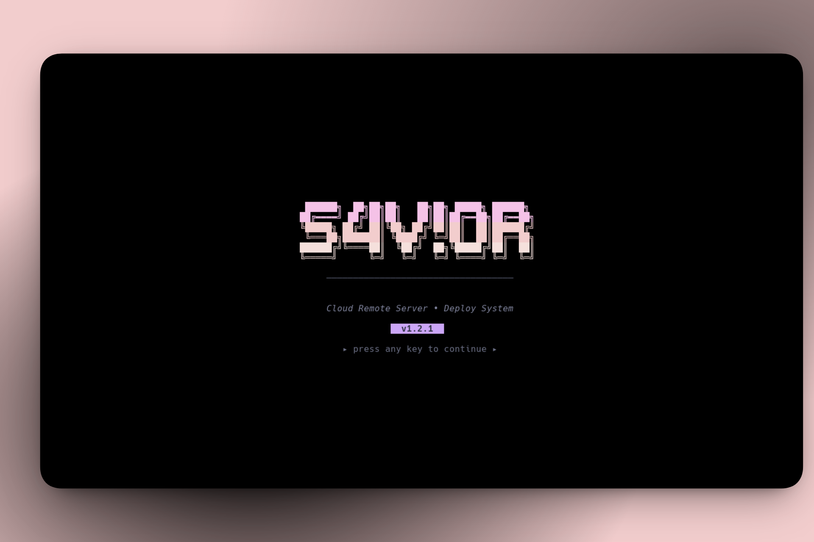

# SSH Deploy TUI

Deploy and manage remote projects from your terminal. Built with Go + [Bubble Tea](https://github.com/charmbracelet/bubbletea).



## Features

- **One-step deploy** — git pull, install, build and restart
- **PM2** — status, real-time logs, restart
- **Nginx** — view config, test syntax, reload
- **Tunnels** — SSH port forwarding (e.g. remote DB on localhost)
- **Multi-project** — PM2 or static, all from one config

## Usage

```sh
git clone https://github.com/S4vi0r17/ssh-deploy-tui.git
cd ssh-deploy-tui
go mod tidy                          # download dependencies
cp config.example.yaml config.yaml  # edit with your data
go run .                             # run without installing
```

### Global install (optional)

```sh
go install .  # builds and copies "sdt" binary to ~/go/bin/
sdt           # run from anywhere
```

> Requires [Go](https://go.dev/) 1.24+

## Config location

`sdt` looks for config in this order:

1. `./config.yaml` (current directory)
2. `~/.config/sdt/config.yaml`

```sh
# Option A: use in project directory
cp config.example.yaml config.yaml

# Option B: global install
mkdir -p ~/.config/sdt
cp config.example.yaml ~/.config/sdt/config.yaml
```

Then run `sdt` from anywhere.

## Configuration

```yaml
app_name: "My Deploy"

ssh:
  host: your-server-ip
  port: 22
  user: your-user
  identity_file: $HOME/.ssh/id_rsa
  # Runs before every SSH command (non-interactive sessions don't load .zshrc)
  init_cmd: "export PATH=$HOME/.local/share/fnm:$PATH && eval \"$(fnm env --shell zsh)\" && export PATH=$HOME/.bun/bin:$HOME/.local/share/pnpm:$PATH && export GIT_SSH_COMMAND='ssh -i $HOME/.ssh/github_deploy_key -o IdentitiesOnly=yes'"

projects:
  my-backend:
    name: "My Backend"
    path: /var/www/html/my-backend
    type: pm2 # managed by PM2
    branch: main
    package_manager: pnpm
    install_cmd: pnpm install
    build_cmd: pnpm build
    pm2_name: my-backend

  my-frontend:
    name: "My Frontend"
    path: /var/www/html/my-frontend
    type: static # static site (no PM2)
    branch: main
    package_manager: bun
    install_cmd: bun install
    build_cmd: bun run build
    output_dir: dist

nginx:
  config_path: /etc/nginx/nginx.conf
  sites_path: /etc/nginx/sites-available

# SSH tunnels (local port forwarding)
tunnels:
  - name: "MySQL"
    local_port: 3306 # port on your machine
    remote_host: "127.0.0.1" # host as seen from the server
    remote_port: 3306 # port on the server
    auto_start: true # activate on connect
```

### `init_cmd`

Non-interactive SSH sessions don't load `.zshrc`, so `node`, `bun`, `pnpm`, etc. won't be found. `init_cmd` runs before every command to fix that.

| Part                                                                        | Why                                |
| --------------------------------------------------------------------------- | ---------------------------------- |
| `export PATH=$HOME/.local/share/fnm:$PATH && eval "$(fnm env --shell zsh)"` | Load `node` via `fnm`              |
| `export PATH=$HOME/.bun/bin:$HOME/.local/share/pnpm:$PATH`                  | Load `bun`/`pnpm`                  |
| `export GIT_SSH_COMMAND='ssh -i ...'`                                       | Use a deploy key for private repos |

If you only need Node with `fnm`:

```yaml
init_cmd: "export PATH=$HOME/.local/share/fnm:$PATH && eval \"$(fnm env --shell zsh)\""
```

## Tech Stack

[Go](https://go.dev/) · [Bubble Tea](https://github.com/charmbracelet/bubbletea) · [Lip Gloss](https://github.com/charmbracelet/lipgloss) · [x/crypto/ssh](https://pkg.go.dev/golang.org/x/crypto/ssh)
